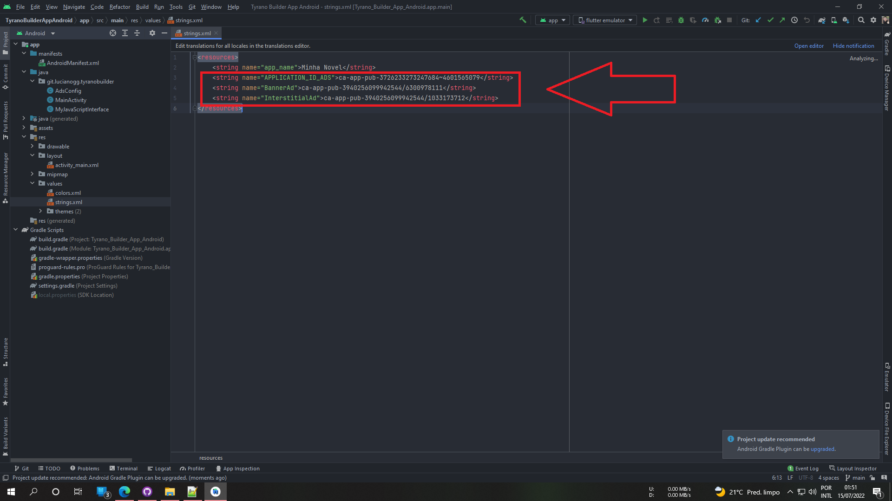
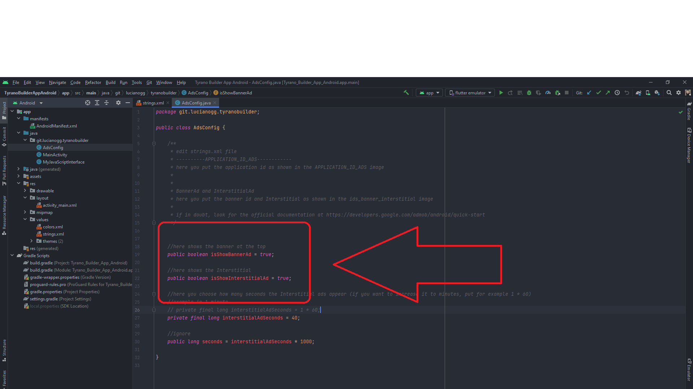

<h1 align="center">Update Tyrano Builder App Android</h1>

<!-- ABOUT THE PROJECT -->
## About The Project
this project is a recent update of TyranoBuilder for Android

<!-- GETTING STARTED -->
## Getting Started
### Prerequisites
   * Android Studio
   * TyranoBuilder Studio

### Installation
1. Clone the repo or project download
   ```sh
   git clone https://github.com/lucianoGG/tyranobuilder-android
   ```

2. change app name
   ```sh
   TyranoBuilderAppAndroid\app\src\main\res\values -> strings.xml
   ```
   
   
   
   
3. change pakagename

   

   


4. updated project with
   - [x] android 12 working
   - [x] access notification to save and read game saves according to android policy
   - [x] notification when leaving the game
   - [x] ads by Google admob

5. future updates project
   - [ ] iOS
   - [ ] Flutter
   
6. ads by Google admob - edit strings.xml file ( APPLICATION_ID_ADS and BannerAd and InterstitialAd )
   ```sh
   TyranoBuilderAppAndroid\app\src\main\res\values -> strings.xml
   ```
   
   
   
Edit the AdsConfig.class file if necessary
   ```sh
   TyranoBuilderAppAndroid\app\src\main\java\git\lucianogg\tyranobuilder -> AdsConfig.class
   ```
   
  * isShowBannerAd (true/false) - show the banner at the top
  * isShowInterstitialAd (true/false) - show Interstitial ads
  * interstitialAdSeconds - here you configure how many seconds the interstitial ads appear on the screen, default is 40 seconds, if you want to put it in minutes, add     the value * 60, for example 1 * 60 (one minute) and avoid putting little because it can be banned from the admob

   
   


buy a coffee on paypal

   

