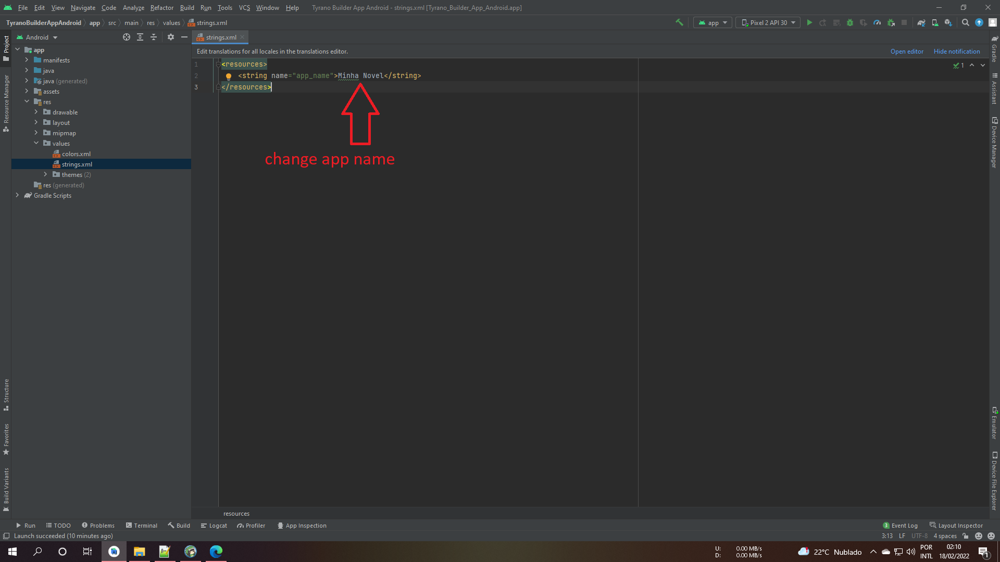

<h1 align="center">Update Tyrano Builder App Android</h1>

<!-- ABOUT THE PROJECT -->
## About The Project
this project is a recent update of TyranoBuilder for Android

<!-- GETTING STARTED -->
## Getting Started
### Prerequisites
* Android Studio
* TyranoBuilder Studio

### Installation
1. Clone the repo or project download
   ```sh
   git clone https://github.com/lucianoGG/tyranobuilder-android
   ```

2. change app name
   ```sh
   TyranoBuilderAppAndroid\app\src\main\res\values -> strings.xml
   ```
   
   
   
3. change pakagename


4. updated project with
- [x] android 12 working
- [x] access notification to save and read game saves according to android policy
- [x] notification when leaving the game

5. futres updated project
- [] ads by google admob
- [] iOS
- [] Flutter

6. buy a coffee on paypal


